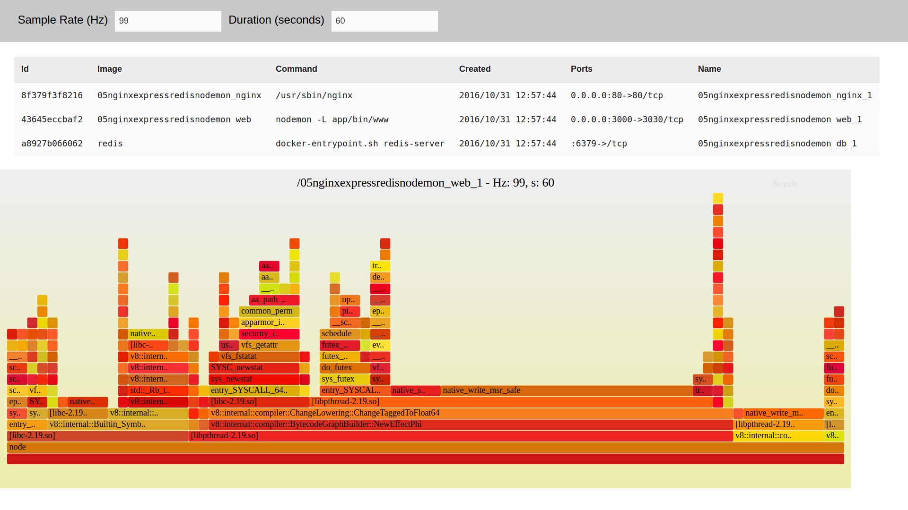

# burning-container

A [Hoplon][4] project with [Castra][2] for generating [Flame Graphs][8] from local [Docker][9] containers.

[](https://www.youtube.com/watch?v=fymb0yBbGnk)

## Dependencies

- java 1.7+
- [boot][1]

## Usage
### Development
0. Install [FlameGraph](git clone https://github.com/brendangregg/FlameGraph) scripts in your path (um yes, I know, I'm ashamed, it's PoC)

    ```bash
    git clone https://github.com/brendangregg/FlameGraph  # or download it from github
    cd FlameGraph
    sudo cp *.pl *.awk /usr/local/bin
    ```

1. Start the `dev` task. In a terminal run:
    ```bash
    $ boot dev
    ```
    This will give you a  Hoplon development setup with:
    - auto compilation on file changes
    - audible warning for compilation success or failures
    - auto reload the html page on changes
    - Clojurescript REPL

2. Go to [http://localhost:8000][3] in your browser.

3. If you edit and save a file, the task will recompile the code and reload the
   browser to show the updated version.

### Production
TBD

### Deployment
TBD

## License

Copyright © 2016, **Udacity**

[1]: http://boot-clj.com
[2]: https://github.com/hoplon/castra
[3]: http://localhost:8000
[4]: https://hoplon.io
[5]: https://www.heroku.com/
[6]: https://toolbelt.heroku.com/
[7]: https://devcenter.heroku.com/articles/war-deployment#deployment-with-the-heroku-toolbelt
[8]: http://www.brendangregg.com/FlameGraphs/cpuflamegraphs.html
[9]: https://docs.docker.com
